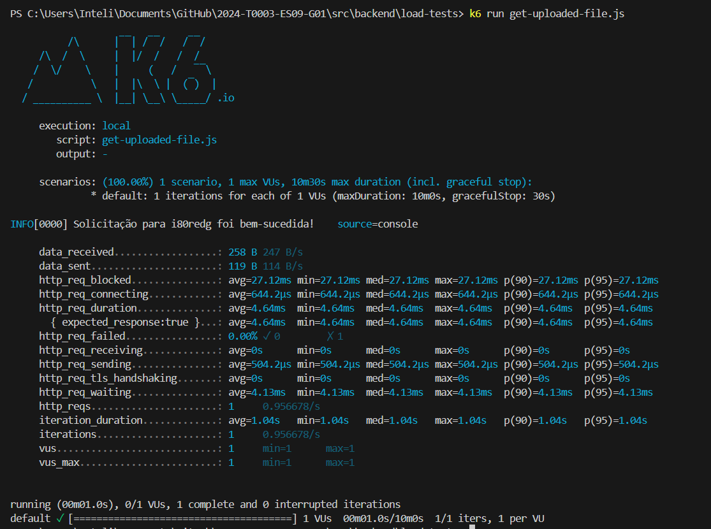

Eu escolhi esse endpoint “http://localhost:3001/link-lists/uploaded-file/file_model.csv”, o cógido que fiz para testar esse endpoint usando k6 foi esse:

```
import http from 'k6/http';
import { sleep } from 'k6';

export default function () {
  // Gerando um caminho dinâmico do arquivo para teste
  const path = Math.random().toString(36).substring(7); // Gerando uma sequência aleatória para o path
  
  // Fazendo uma solicitação GET para o endpoint com o caminho dinâmico do arquivo
  const response = http.get('http://localhost:3001/link-lists/uploaded-file/file_model.csv');
    
  // Verificando se a resposta teve sucesso (status code 200)
  if (response.status === 200) {
    console.log(`Solicitação para ${path} foi bem-sucedida!`);
  } else {
    console.log(`Erro ao fazer solicitação para ${path}. Status code: ${response.status}`);
  }

  // Aguardando um curto período de tempo entre as solicitações
  sleep(1);
}
```

1. **`import http from 'k6/http';`**: Esta linha importa a biblioteca **`http`** do módulo **`k6`**. Isso permite que o script faça solicitações HTTP usando o k6.
2. **`import { sleep } from 'k6';`**: Esta linha importa a função **`sleep`** do módulo **`k6`**. A função **`sleep`** é usada para pausar a execução do script por um determinado período de tempo.
3. **`export default function () { ... }`**: Esta é a definição da função principal do script. O código dentro desta função será executado quando o script for iniciado pelo k6.
4. **`const path = Math.random().toString(36).substring(7);`**: Esta linha gera um caminho dinâmico para o arquivo de teste. Usa-se **`Math.random()`** para gerar um número aleatório, **`toString(36)`** para convertê-lo em uma string na base 36, e **`substring(7)`** para obter uma substring começando do sétimo caractere, criando assim uma sequência aleatória para o caminho.
5. **`const response = http.get('http://localhost:3001/link-lists/uploaded-file/file_model.csv');`**: Esta linha faz uma solicitação GET para o endpoint especificado, que contém o caminho dinâmico gerado anteriormente. O resultado da solicitação é armazenado na variável **`response`**.
6. **`if (response.status === 200) { ... } else { ... }`**: Esta estrutura condicional verifica se a solicitação foi bem-sucedida, verificando se o status da resposta é igual a 200 (OK). Se for, uma mensagem de sucesso é registrada no console. Caso contrário, uma mensagem de erro é registrada, incluindo o status da resposta.
7. **`sleep(1);`**: Esta linha faz com que o script aguarde 1 segundo antes de continuar. Isso é útil para simular um comportamento mais realista em testes de carga, permitindo que o script simule o comportamento de usuários interagindo com o sistema em um ritmo mais humano.

Ao rodar o K6 é gerado esse relatório no terminal, que indica que o teste foi executado com sucesso, sem falhas, e fornece uma visão geral do desempenho do aplicativo durante o teste.


